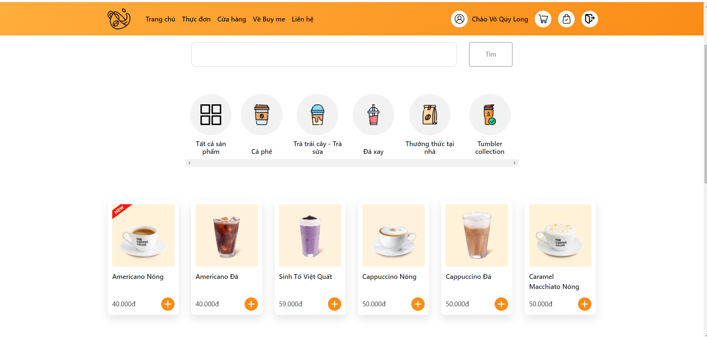

<p align="center">
  <a href="https://buymee.herokuapp.com">
    
    <h2 align="center">POINT OF SALE</h2>
    <h3 align="center">Pure PHP MVC</h3>
  </a>
</p> 
<p align="center">Finally a POS system that integrates with your marketing, sales, inventory and eCommerce. A simple and flexible POS you can configure to meet your retail shop's precise needs.</p>

[](https://travis-ci.org/anuraghazra/anuraghazra.github.io)





*NOTE: If you are using this site as a template for your own portfolio site, I would be very glad if you add a link to the original site with my name in footer*

## :rocket: Quick start

**Run the site locally**

_NOTE: The default branch for this repo is `master`, when you push or pull make sure you specify the correct branch_

### Step 1: Clone The Repo

Fork the repository. then clone the repo locally by doing -

```bash
git clone https://github.com/hcmut-odoo/pos
```

### Step 2: Install Dependencies

Access into the project directory

```bash
cd pos
```

Install all the dependencies
```bash
composer install
```

Install and build bereeze
```bash
npm install
npm run dev
```

### Step 3: Setup enviroment variables
Copy and create a new enviroment variables from example

```bash
cp .example.env .env
```

Fill database connection

```bash
DB_CONNECTION=mysql
DB_HOST=127.0.0.1
DB_PORT=3306
DB_DATABASE=pos_ecommerce
DB_USERNAME=root
DB_PASSWORD=
```

### Step 4:
Migrate database

```bash
php artisan migration
```

Terminal returns the following, you have already run migrate successfully:

```bash
[2021-10-28 19:10:49] - Applying migration m0001_initial.php
[2021-10-28 19:10:49] - Applyied migration m0001_initial.php
```

### Step 5: Start Development Server

Then start the development Server
```
php artisan serve
```
After running the development server the site should be running on https://localhost:8000

## Tools Used

1. Docker
2. Github action for CI/CD

## :v: Contributing

*NOTE: if you want to change the [blog content](./content) or fix any typo you can do that from github's ui without cloning the repo locally*

After cloning & setting up the local project you can push the changes to your github fork and make a pull request.

> You can also run the tests locally to see if everything works fine with

### Pushing the changes

```bash
git add .
git commit -m "commit message"
git push YOUR_REPO_URL master
```

Made with my :heart: and youthful enthusiasm
